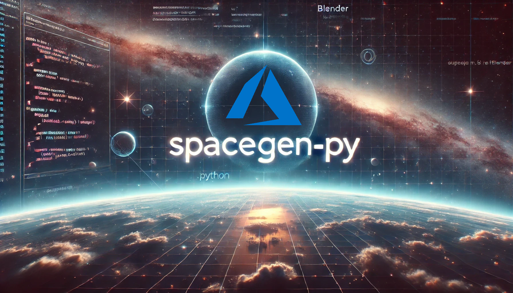
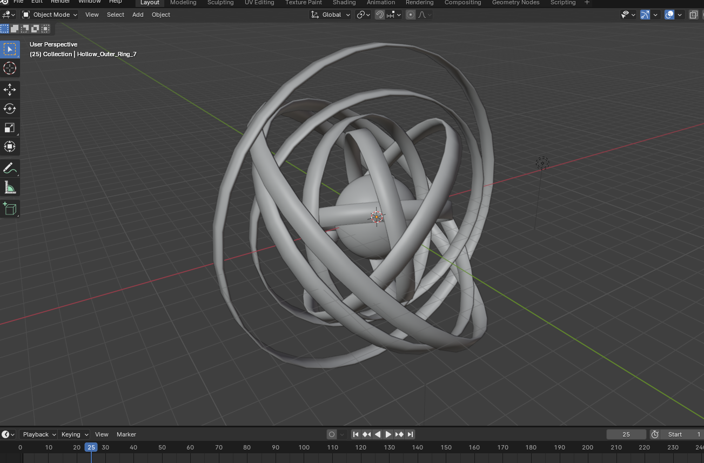
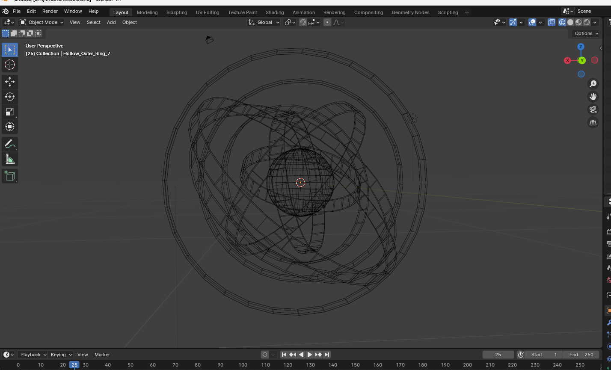
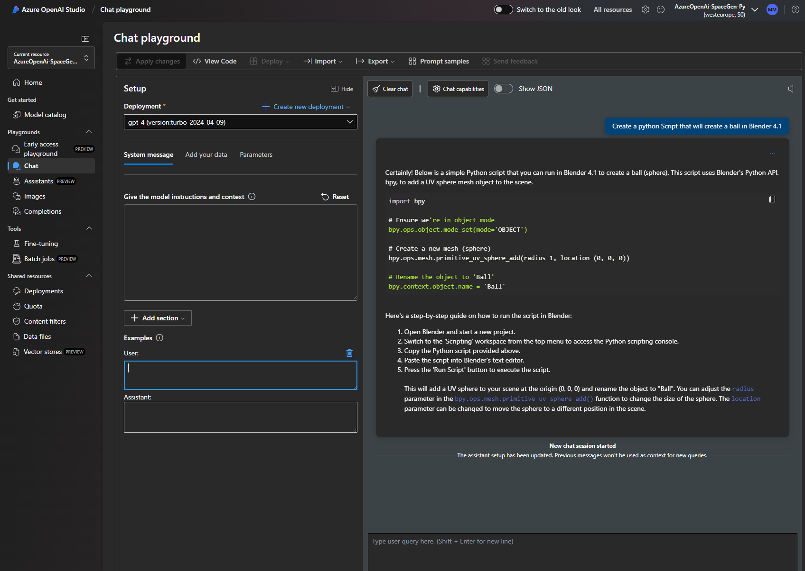
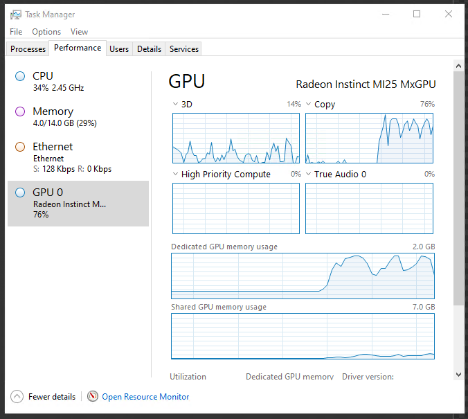
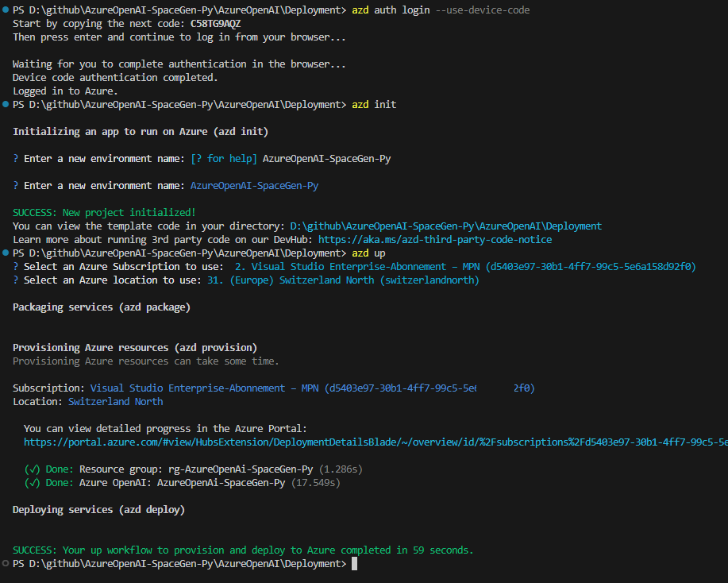

# 🌌 AzureOpenAI-SpaceGen-PY - 3D Modeling with Azure OpenAI, Blender, and Python

Welcome to **AzureOpenAI-SpaceGen-PY**, a project where **Azure OpenAI**, **Python**, and **Blender** come together to generate 3D space models. The project leverages the **Azure OpenAI** model to help generate Python code for creating 3D models in Blender, using a step-by-step process.

## 💡 What is AzureOpenAI-SpaceGen-PY about?

The main goal of AzureOpenAI-SpaceGen-PY is to create 3D space models, such as **Tabby’s Star** (KIC 8462852), using Azure OpenAI to generate Python scripts for Blender. **Tabby’s Star** is a mysterious star known for its **unusual light emissions**, which remain unexplained. Some scientists have proposed the theory of a **Dyson Sphere**, a massive structure built by an advanced civilization to harness energy from the star.

## 🛠️ How does it work?

1. **Azure OpenAI and Deployment**:
   - The Azure OpenAI model is deployed using the **Azure Developer CLI (azd)**. The deployment configuration can be found at:
     - `AzureOpenAI\Deployment\azure.yaml`

2. **Prompting for Python Scripts**:
   - Once deployed, a **PowerShell script** is used to interact with Azure OpenAI to generate the necessary Python code for Blender.
     - PowerShell Script: `AzureOpenAI\Prompt\run.ps1`

3. **Blender Python Script**:
   - The final Python script that generates the 3D model is stored here:
     - `Blender\main.py`

## 🚀 How to run the script?

### 1️⃣ Prerequisites
- **Blender 4.1**: Download and install Blender from [Blender.org](https://www.blender.org/download/).
- **Python 3.7+**: Blender comes with its own Python installation.
- **Azure OpenAI access**: For generating custom scripts via the Azure OpenAI Playground and finally use `AzureOpenAI\Prompt\run.ps1`

### 2️⃣ Installation
1. Clone the repository:
   ```bash
   git clone https://github.com/yourusername/AzureOpenAI-SpaceGen-PY.git
2. Open Blender, navigate to the **Scripting** tab, and load the Python scripts from the repository (`Blender\main.py`).

3. Run the script to generate the 3D space model.

### 3️⃣ Running the project
- Deploy Azure OpenAI using the provided `azure.yaml` file with the **Azure Developer CLI (azd)**.
- Use the PowerShell script to interact with the model and generate Python code.

This project used an **NVv4 series Azure VM** for rendering, which includes:
- **AMD Radeon Instinct MI25 GPUs**
- **AMD EPYC 7V12 (Rome) CPUs**

This VM size was chosen to handle the computational intensity of the rendering process efficiently.

### 4️⃣ Images and Media
- **Tabby's Star Final Result (GIF)**: 
- **Material Preview Mode**: 
- **Solid Mode**: 
- **Wireframe Edges**: 
- **Azure OpenAI Playground Prompt**: 
- **Azure VM Task Manager GPU during Rendering**: 


### 🌐 Azure OpenAI Deployment with Azure Developer CLI (azd)

This project uses the **Azure Developer CLI (azd)** for deploying the Azure OpenAI resources and is configured using **Bicep** for infrastructure as code.

#### Steps to Deploy
1. Install the Azure Developer CLI:
   ```bash
   winget install microsoft.azd

2. Log in to your Azure account:
   ```bash
   azd auth login --use-device-code

Follow the instructions to enter the code at Microsoft.com/devicelogin.

3. Initialize the project with Azure Developer CLI:
   ```bash
   azd init

4. Use the Bicep configuration from the Deployment folder to deploy your resources.
   ```bash
   azd up

Deployment Path: The Bicep configuration is located in AzureOpenAI\Deployment\azure.yaml.

By using Azure Bicep, this deployment automates the creation of the required resources in Azure, making it easy to manage and scale your infrastructure. The Bicep templates provide a clear and maintainable approach to defining cloud infrastructure.



### 🌠 What is Tabby's Star?
**Tabby’s Star**, also known as **KIC 8462852**, is a star that exhibits **unexplained, irregular light emissions**. While the exact cause of these fluctuations remains unknown, one hypothesis is the **Dyson Sphere theory**. This theory posits that an advanced civilization might construct a megastructure around the star to harness its energy, although this remains purely speculative.

### 🧩 Customization
- Modify the Blender settings, materials, and model scale to adapt the script to other celestial objects or simulations.
- Experiment with Azure OpenAI to generate new variations and explore different 3D models.

### 🚀 Future Plans
- Add support for animations.
- Explore more complex space phenomena and procedural generation.
- Improve Azure OpenAI’s code generation to handle more advanced 3D modeling tasks.

### 🤝 Contributions
Feel free to fork the project, test the scripts, and propose any improvements! Contributions are always welcome.

### 📜 License

This project is licensed under the MIT License. See [LICENSE](LICENSE) for more information.

### Disclaimer
**AzureOpenAI-SpaceGen-PY** makes use of third-party services such as **Blender**, **Azure OpenAI**, and **Python**. All rights to these services and tools belong to their respective owners, and this project does not claim any ownership of them. This project is intended for **educational purposes** only and is not meant for commercial use.

The scripts and models generated in this repository are created for learning purposes and to demonstrate the integration of AI-assisted code generation with 3D modeling in Blender. The project is shared **as-is**, without any warranty of its fitness for any particular purpose.
